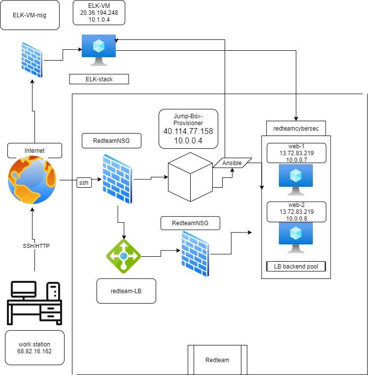

# Cybersecurity
UPENN cybersecurity bootcamp

## Automated ELK Stack Deployment

The files in this repository were used to configure the network depicted below.

 

These files have been tested and used to generate a live ELK deployment on Azure. They can be used to either recreate the entire deployment pictured above. Alternatively, select portions of the _____ file may be used to install only certain pieces of it, such as Filebeat.

 ansible-playbook install-elk.yml

---
- name: Installing and launching filebeat
  hosts: elk
  become: yes
  tasks:

    # Use command module
  - name: Download filebeat deb
    command: curl -L -O https://artifacts.elastic.co/downloads/beats/filebeat/filebeat-7.6.1-amd64.deb

    # Use command module
  - name: Install filebeat deb
    command: dpkg -i filebeat-7.6.1-amd64.deb

    # Use copy module
  - name: Drop in filebeat.yml
    copy:
      src: /etc/ansible/files/filebeat-config.yml
      dest: /etc/filebeat/filebeat.yml
 
    # Use command module
  - name: Enable and configure system module
    command: filebeat modules enable logstash

    # Use command module
  - name: Setup filebeat
    command: filebeat setup

    # Use command module
  - name: Start filebeat service
    command: sudo service filebeat start
This document contains the following details:

Description of the Topology
Access Policies
ELK Configuration
Beats in Use
Machines Being Monitored
How to Use the Ansible Build
Description of the Topology
The main purpose of this network is to expose a load-balanced and monitored instance of DVWA, the Damn Vulnerable Web Application.

Load balancing ensures that the application will be highly available, in addition to restricting traffic to the network.

What aspect of security do load balancers protect? A load balancer protects against Distributed Denial-of-Service (DDoS) attacks.
What is the advantage of a jump box? A Jump Box controls access to other machines by allowing connections from specific IP addresses, then forwarding those connections to their respective machines.
Integrating an ELK server allows users to easily monitor the vulnerable VMs for changes to the logs and system traffic.

-What does Filebeat watch for? Filebeat watches and collects the data about the file system.
-What does Metricbeat record? Metricbeat records and collects the operating machine metrics.

The configuration details of each machine may be found below.
_Note: Use the [Markdown Table Generator](http://www.tablesgenerator.com/markdown_tables) to add/remove values from the table_.

| Name     | Function       | IP Address | Operating System |
|----------|----------      |------------|------------------|
| Jump Box | Gateway        | 10.0.0.4   | Linux            |
| web1     | VM             | 10.0.0.7   | linux            |
| web2     | VM             | 10.0.0.8   | linux            |
| ELK-VM   | ELK            | 10.1.0.4   | linux            |
|redteam-LB| loadbalancer   |            | linux            |

### Access Policies

The machines on the internal network are not exposed to the public Internet. 

Only the Jump Box machine can accept connections from the Internet. Access to this machine is only allowed from the following IP addresses:
- it can only be accesed via my personal IP
68.XX.XX.162

Machines within the network can only be accessed by 
jumpbox via ssh.
 -Which machine did you allow to access your ELK VM? jumpbox via ansible.  
 -What was its IP address? 10.0.0.4

A summary of the access policies in place can be found in the table below.

| Name     | Publicly Accessible | Allowed IP Addresses |
|----------|---------------------|----------------------|
| Jump Box | Yes                 |  68.82.16.162        |
|  web1    | no                  |  10.0.0.7            |
|  web2    | no                  |  10.0.0.8            |
| ELK-VM   | no                  |  10.1.0.4

### Elk Configuration

Ansible was used to automate configuration of the ELK machine. No configuration was performed manually, which is advantageous because...
- _TODO: What is the main advantage of automating configuration with Ansible?_  simplicity, putting commands from multiple servers into one simple playbook.

The playbook implements the following tasks:
- ... 1. sudo apt install dockerio
- ... 2. instal pythonpip
- ... 3. systemctl  w vm.max_map_counts_26114

The following screenshot displays the result of running `docker ps` after successfully configuring the ELK instance.
Ansible was used to automate configuration of the ELK machine. No configuration was performed manually.

What is the main advantage of automating configuration with Ansible? Automating with Ansible allows you create consistent, reproducable results throughout multiple machine configurations.
The playbook implements the following tasks:

Explain the steps of the ELK installation play.
Install docker.io
Install python3.pip
Install docker module
Increase virtual memory
Use more memory
Download and lauch a docker elk container through published ports:
5601:5601
9200:9200
5044:5044
The following screenshot displays the result of running docker ps after successfully configuring the ELK instance.
/c/Users/ilove/OneDrive/Pictures/Screenshots/status.png.png

### Target Machines & Beats
This ELK server is configured to monitor the following machines:
web1 10.0.0.7
web2 10.0.0.8
ELK-VM 10.1.0.4
We have installed the following Beats on these machines:

-filebeat

-metricbeat

These Beats allow us to collect the following information from each machine:
 filebeat collects the changes done.
while metricbeat colllects statistics and metrics.

### Using the Playbook
In order to use the playbook, you will need to have an Ansible control node already configured. Assuming you have such a control node provisioned: 

SSH into the control node and follow the steps below:
- Copy the .yml file to ansible folder.
- Update the config file to include... the correct ip adress
- Run the playbook, and navigate to kibana to check that the installation worked as expected.

- _Which file is the playbook? Where do you copy it?
filebeat config.yml, in etc/ansible/files
- _Which file do you update to make Ansible run the playbook on a specific machine? How do I specify which machine to install the ELK server on versus which to install Filebeat on?
the jumpbox
- _Which URL do you navigate to in order to check that the ELK server is running? 
68.XX.XX.162/5106

_As a **Bonus**, provide the specific commands the user will need to run to download the playbook, update the files, etc._
nano /etc/ansible/ansible.cfg
nano /etc/ansible/hosts
ansible all -m ping
nano <your-playbook.yml>
ansible-playbook <your-playbook.yml>
ssh ansible@<XX.X.X.X>
curl <local.host>/setup.php
